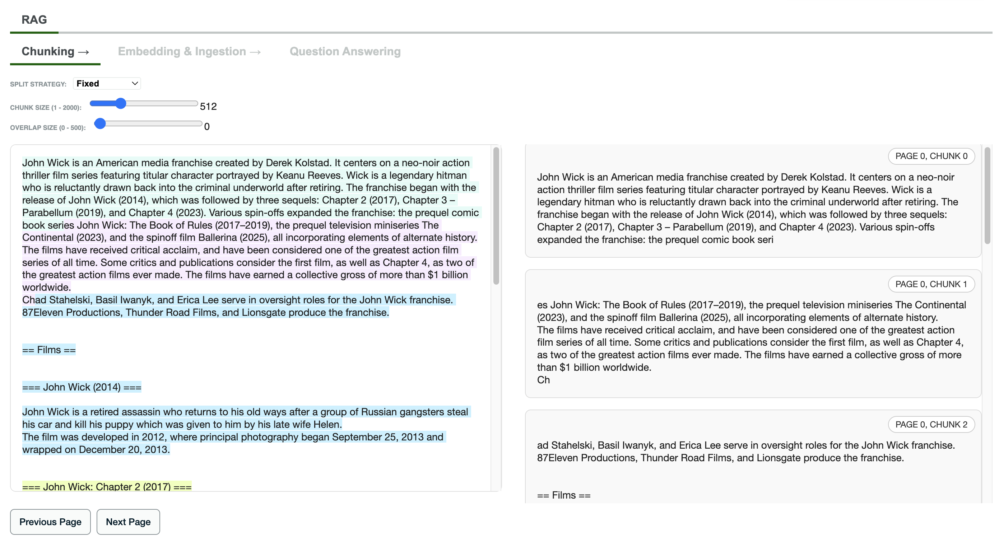

# MongoDB AI Playground

MongoDB AI Playground is a set of interactive widgets for to explore, test, and visualize MongoDB-powered AI capabilities in notebooks, including Retrieval-Augmented Generation (RAG) and GraphRAG workflows, using modern LLM and vector search integrations.

---

## Overview



Built as a set of [AnyWidget](https://anywidget.dev/) Jupyter widgets, this playground is designed for rapid prototyping, learning, and demonstration of GenAI + MongoDB workflows.

## Prerequisites

- An [**Atlas account**](https://account.mongodb.com/account/register?tck=docs_atlas) with a cluster running **MongoDB version 6.0.11**, **7.0.2**, or later (including release candidates). Ensure your **IP address** is included in your Atlas project's [**access list**](https://www.mongodb.com/docs/atlas/security/ip-access-list/#std-label-access-list). To learn more, see [**Create a Cluster**](https://www.mongodb.com/docs/atlas/tutorial/create-new-cluster/#std-label-create-new-cluster).
- An environment to run interactive Python notebooks such as JupyterLab, Jupyter Notebook, Google Colab and VSCode. Make sure you have widget support enabled (it is enabled by default on most platforms).
- Create a database and collection (if you choose to use an existing collection, usage with the playground will erase the collection's data. Providing a new collection is recommended)
- [**Create an Atlas Vector Search index**](https://www.mongodb.com/docs/compass/current/indexes/create-vector-search-index/) with the correct dimension associated with the embedding model you will use. The field containing the embedding must be named **`embedding`**.

## Installation

```bash
pip install mongodb-ai-playground
```

## Usage

### RAG Playground

```python
from mongodb_ai_playground import MongoDBRAGPlayground

# Example: Pass your own loader, embedding model, LLM, and MongoDB collection
widget = MongoDBRAGPlayground(
    loader=...,              # LangChain loader
    embedding_model=...,     # LangChain embedding model 
    llm=...,                 # LangChain Chat Model (LLM) for answering questions (OpenAI, Claude, DeepSeek, etc.)
    mongo_collection=...,    # PyMongo collection for storing vectors
    index_name=...           # Name of your Atlas Vector Search index, you need to create if you don't have one, with the correct dimension (field containing the embedding is 'embedding')
)
widget # Display the playground widget
```

- All interactions are performed via the interactive UI in Jupyter-compatible environments.
- Visualize chunking, embeddings, vector search results, and question answering.

Notebook examples

| Description                                        | Link                                                                                                                                                      |
|----------------------------------------------------|-----------------------------------------------------------------------------------------------------------------------------------------------------------|
| Wikipedia data + Voyage AI embedding + OpenAI LLM | [](https://colab.research.google.com/github/mongodb-developer/mongodb-ai-playground/blob/main/examples/mongodb_rag_playground_wiki_voyageai_openai.ipynb) |


## Features

- 📄 **Document Chunking**: Flexible strategies (fixed, recursive, markdown) for splitting documents.
- 🧠 **Embeddings & Vector Search**: Store and search embeddings in MongoDB Atlas using [langchain-mongodb](https://github.com/langchain-ai/langchain-mongodb).
- 🔎 **RAG Playground UI**: Step-by-step interface for chunking, embedding, and querying.
- 🕸️ **Knowledge Graph RAG**: Build and visualize entity/relation graphs from docs and run graph-based QA.
- 🧩 **Extensible**: Built for experimentation with LangChain so that you can use different loaders, embeddings models, LLMs and more.

---

## Project Structure

```
mongodb_ai_playground/
├── rag_widget.py         # RAG playground widget (chunking, embedding, RAG)
├── graphrag_widget.py    # Graph RAG playground widget (graph ingest, QA)
├── index.js              # JS frontend for RAG widget
├── graphrag.js           # JS frontend for Graph RAG widget
├── index.css             # Shared widget styles
├── __init__.py           # Exports widgets
...
```

---

## Requirements
- Python 3.7+
- Jupyter widget compatible environments (JupyterLab, Jupyter Notebook, Colab, Marimo, etc.) 
- MongoDB Atlas deployment (for vector/graph storage)
- Any LLM and embedding model using LangChain components (OpenAI, HuggingFace, etc.)

---

## License

This project is licensed under the [MIT License](LICENSE).

## Acknowledgments

- [AnyWidget](https://anywidget.dev/)
- [LangChain](https://python.langchain.com/)
- [langchain-mongodb](https://github.com/mongodb-developer/langchain-mongodb)
- [PyMongo](https://pymongo.readthedocs.io/)
- [MongoDB Atlas](https://www.mongodb.com/atlas)

## Additional Resources

* [GenAI Showcase](https://github.com/mongodb-developer/GenAI-Showcase)
* [AI Learning Hub](https://www.mongodb.com/resources/use-cases/artificial-intelligence?utm_campaign=ai_learning_hub&utm_source=github&utm_medium=referral)
* [GenAI Community Forum](https://www.mongodb.com/community/forums/c/generative-ai/162)
* [Tutorials and code examples from our official docs](https://github.com/mongodb/docs-notebooks)
